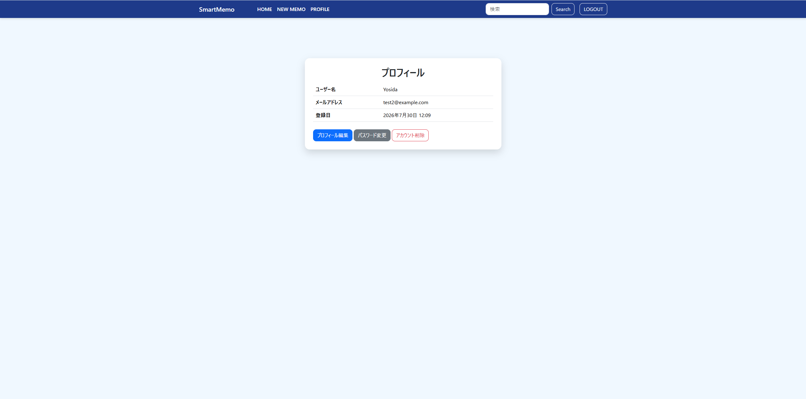
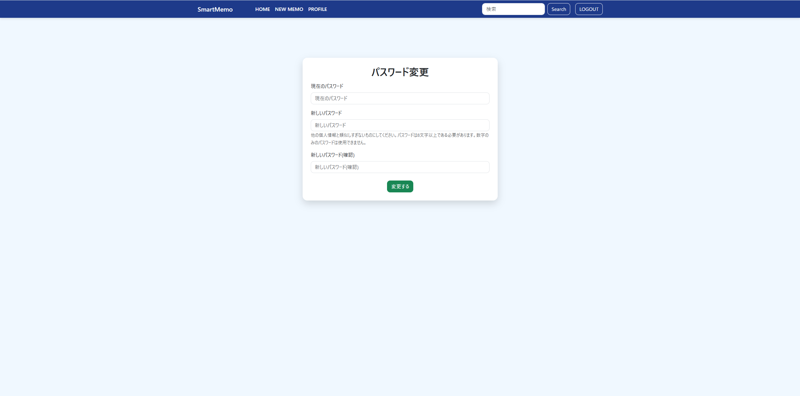
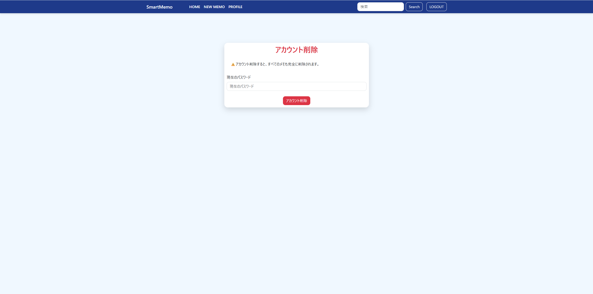
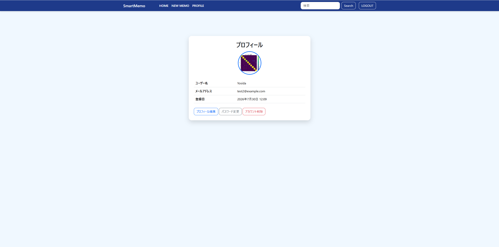
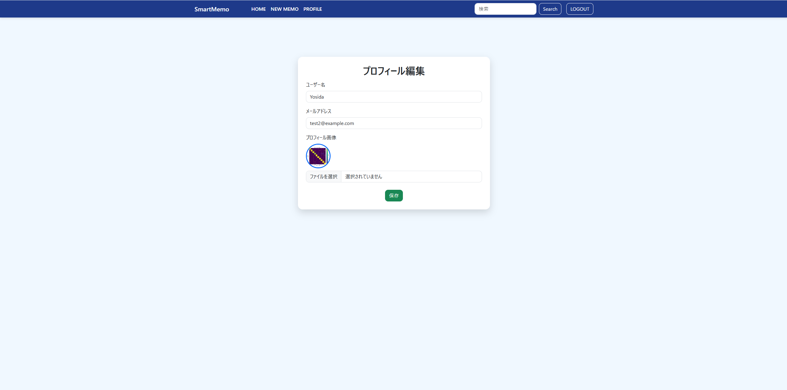
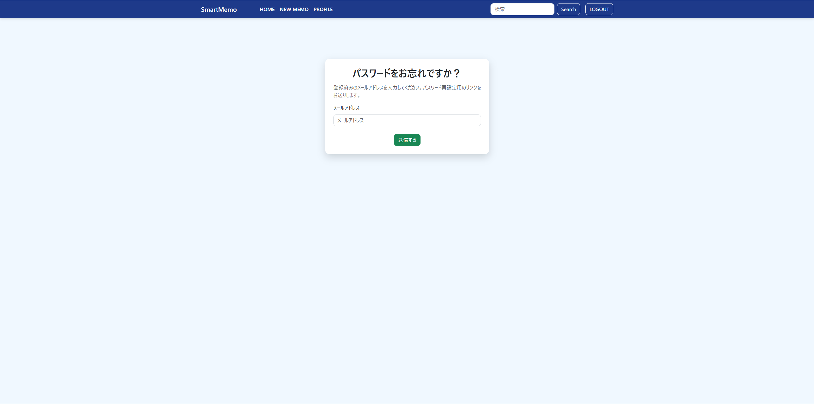

# SmartMemo Ver5.0

### Where Notes Meet Code.

開発期間：2026年6月中旬～継続開発中

> 単なるメモアプリではなく、「メモWrite・コードCode・実行Run」を一つの場所で管理できる
> ハイブリッドメモ帳を目指して開発しています。

##　開発の歩み
※後ほど作成する予定

【アプリのスクリーンショット】

- ログイン画面

- メイン画面

- ログイン失敗時のアラート画面
_v4.0.png)

- ユーザー登録画面

- ユーザー登録パスワードが一致しないときアラート画面
 

- プロフィール画面

- パスワード変更画面

- アカウント削除画面

Django・Bootstrap・CSSで構築したシンプルなメモ管理Webアプリです。

- プロフィール画面にアイコン追加

- プロフィール編集にアイコン変更機能を追加

- パスワードをお忘れですか？画面

## Ver5.0 更新内容
- Gmail SMTPを利用したパスワードリセットメール送信に対応 (Added Gmail SMTP support for password reset emails)
- パスワードリセット機能を実装（Implemented password reset functionality）
- Django 標準のバリデーションメッセージを日本語化（Localized Django validation messages）
- ログイン画面に「パスワードを忘れた方はこちら」リンクを追加（Added a "Forgot your password?" link）

## デバッグしたこと
- makemigrationsの「No changes detected」（保存忘れ）
- apps.pyのready()インデントミス
- ImportError（forms.py未保存）
- RelatedObjectDoesNotExist（既存ユーザーにProfileがない）→ get_or_createで解決
- profile_edit関数が誤って2つ定義されていた → 統合
- enctype="multipart/form-data"の付け忘れ
- card-bodyのdiv閉じタグ位置ミス
- **MEDIA_ROOT**未設定時に画像がプロジェクトルート直下に保存されていた問題 → mediaフォルダを作成し、profile_iconsを正しい場所へ移動して解決

## 改善したこと
- UUID対策：日本語ファイル名によるトラブルを防ぐため、アップロード時にランダムな英数字名へ自動変換する処理を追加
- UIの整理：Djangoのデフォルト表示（"Currently", "Clear", "Change"の英語表記）をやめ、画像プレビュー＋シンプルなファイル選択欄に作り替え
- CSS整理：インラインstyleだった画像の枠線・サイズ指定を、style.cssの.profile-icon / .profile-icon-largeクラスにまとめて管理しやすくしました。

## Features(主な機能)
- ユーザー登録（Sign Up）
- ログイン / ログアウト（Login / Logout）
- パスワードリセット（Password Reset）
- パスワード変更（Password Change）
- プロフィール表示・編集（Profile Management）
- プロフィール画像アップロード（Profile Image Upload）
- メモの作成・編集・削除（Create / Edit / Delete）
- メモ検索（Search）
- カテゴリ管理（Categories）
- アカウント削除（Account Deletion）

## Technical Highlights(開発内容)
- Django標準認証フォームをカスタマイズ（Customized Django authentication forms）
- Bootstrap対応のフォームデザインを実装（Bootstrap-styled forms）
- OneToOneFieldを利用したプロフィール管理（Profile model with OneToOneField）
- ImageFieldを利用したプロフィール画像アップロード機能（Image upload using ImageField）
- Gmail SMTPを利用したパスワードリセットメール送信（Password reset via Gmail SMTP）
-  Django標準バリデーションメッセージの日本語化（Japanese localization of Django validation messages）
- UUIDによるアップロード画像ファイル名の自動生成（Automatic UUID-based filename generation for uploaded images）
- Django Signalsを利用したプロフィール自動作成（Automatic profile creation using Django Signals）

## Tech Stack
- Python
- Django
- Bootstrap 5
- CSS
- SQLite 
- Git
- GitHub

## Future Plans
- PostgreSQL migration
- Responsive UI improvements
- Markdown support
- Code syntax highlighting
- Dark mode
- Email verification

## Version History
- Ver1.0 CRUD
- Ver2.0 Search & Categories
- Ver3.0 Authentication
- Ver4.0 Profile / Password Change / Account Deletion
- Ver5.0 Profile Image Upload & Password Reset

## 開発メモ
SmartMemoは、Djangoの学習とWebアプリケーション開発の理解を目的として開発しています。
現在も継続的に機能追加・改善を行い、バージョンアップを続けています。
将来的には、通常のメモだけでなく、コードも保存・管理できるメモアプリへ発展させる予定です。

  
